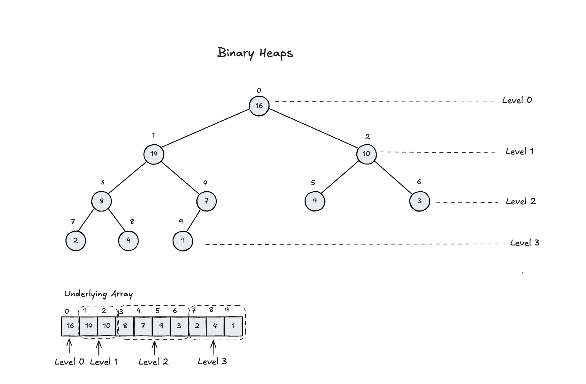
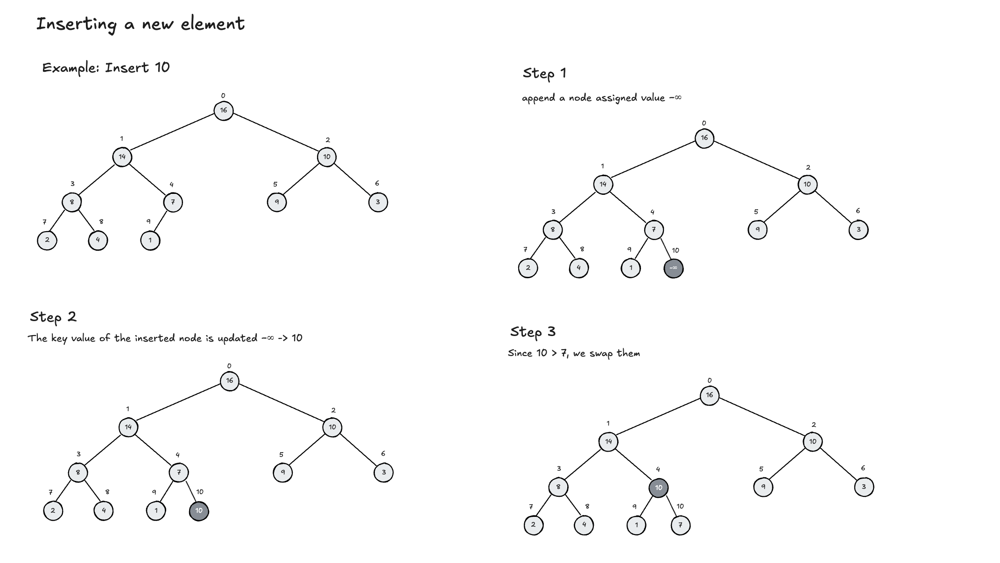
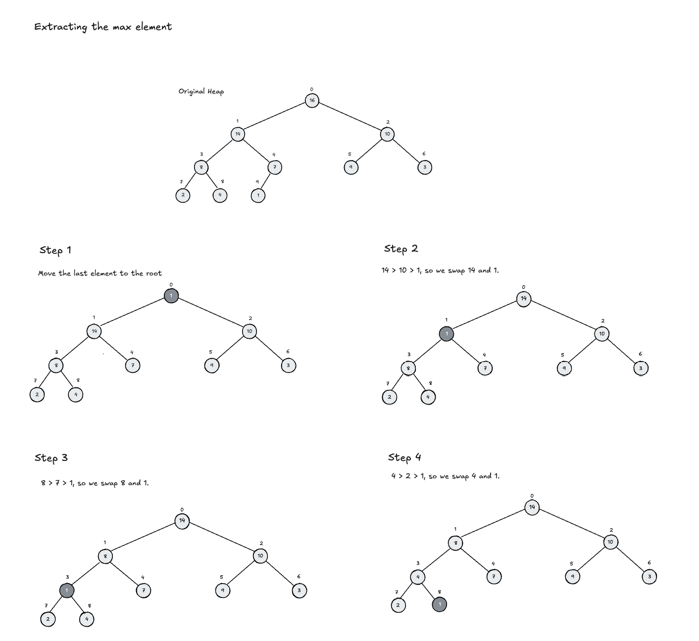
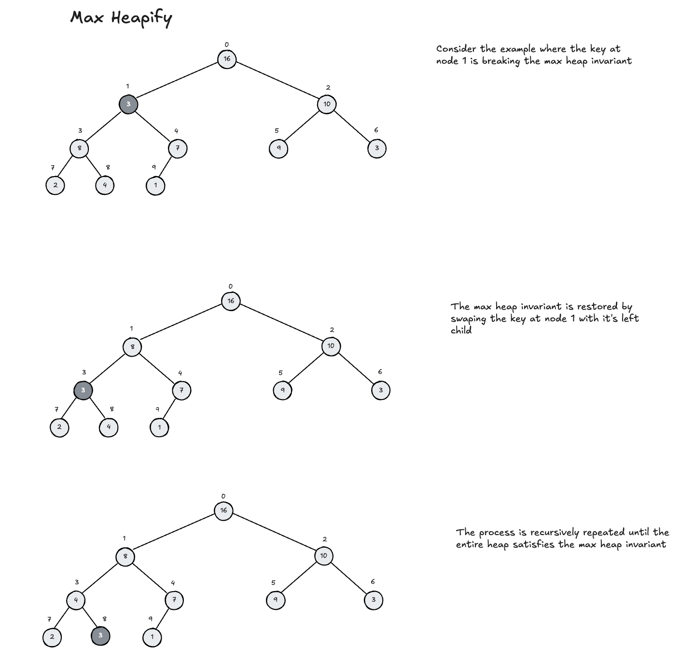

# Classic Data Structures and Algorithms in Python

## Virtual Environment

To create a virtual environment for the project, run
```sh
python3 -m venv dsa_venv
```

To activate the newly created virtual environment, run

```sh
source dsa_env/bin/activate

```

Install the required packages by running

```sh
python3 -m pip install -r requirements.txt
```


# Data Structures

## Linked Lists

A _linked list_ is a data structure that stores objects in a linear order.
Unlike an array, a linked list does not store its elements in contiguous memory locations. Instead, each element in a linked list is stored in a node that contains a pointer to the next node in the sequence.
Linked lists come in various forms, such as singly linked lists, doubly linked lists, and circular linked lists. 

### Terminology
- The first element or node of a linked list is called the _head_ of the list.
- The last element or node of a linked list is called the _tail_ of the list.
- A linked list is _empty_ if it does not contain any elements.
- The _size_ of a linked list is the number of elements it contains.
- A linked list is _circular_ if the last node points to the first node.
- A linked list is _singly linked_ if each node contains a reference to the next node.
- A linked list is _doubly linked_ if each node contains references to the next and previous nodes.
- A linked list is _sorted_ if its elements are arranged in a increasing or decreasing order.
- A linked list is _unsorted_ if its elements are not arranged in any particular order.


### List Operations Summary

| Operation    | Unsorted, Singly Linked | Sorted, Singly Linked | Unsorted, Doubly Linked | Sorted, Doubly Linked |
| ------------ | ----------------------- | --------------------- | ----------------------- | --------------------- |
| `prepend(x)` | $O(1)$                  | $O(n)$                | $O(1)$                  | $O(n)$                |
| `append(x)`  | $O(1)$                  | $O(n)$                | $O(1)$                  | $O(n)$                |
| `find(k)`    | $O(n)$                  | $O(n)$                | $O(n)$                  | $O(n)$                |
| `delete(x)`  | $O(n)$                  | $O(n)$                | $O(1)$                  | $O(1)$                |
| `minimum()`  | $O(n)$                  | $O(1)$                | $O(n)$                  | $O(1)$                |
| `maximum()`  | $O(n)$                  | $O(1)$                | $O(n)$                  | $O(1)$                |


## Binary Heaps
The concept of the _binary heap_ was introduced by J. W. J. Williams in 1964. He described the heap data structure in his paper "Algorithm 232: Heapsort". The heap data structure is an array that can be viewed as a nearly complete binary tree. Each element of the heap corresponds to an element in the array. The tree is filled on all levels except possibly the lowest, which is filled from the left up to a point.




- The root of the heap is given by the first element of an array $H$ (i.e. $H[0]$). 
- Given an index $i$ of the array $H$, we can compute the indices of the parent node, and the left and right children nodes. 
  - The parent of the node at index $i$ is given by the index $⌊(i-1)/2⌋$.  
  - The left child of the node at index $i$ is given by the index $2i + 1$.
  - The right child of the node at index $i$ is given by the index $2i + 2$.

There are two types of binary heaps: min-heaps and max-heaps.
- In a max-heap the key of a parent node is always greater than or equal to the keys of its children nodes, or $H[parent(i)] ≥ H[i]$. 
- In a min-heap, the key of a parent node is always less than or equal to the keys of its children nodes, or $H[parent(i)] ≤ H[i]$.

These conditions are known as the _heap invariant_ for max-heaps and min-heaps respectively.


The height of a heap node is defined as the number of edges on the longest simple downward path from the node to a leaf. The height of the heap is determined by the height of its root.
The height of a heap can be estimated by $O(lg(n))$ where $n$ is the number of elements in the heap.
Most of the heap operations run in proportion to its height, so the running time is usually $O(lg(n))$.


- For $n$ elements, the number of levels in a heap needed to store the the elements can be determined by $L(n) = 1 + ⌊lg(n)⌋$ where $L(n)$ is the number of levels.
- The running time of heapsort is $O(n \lg n)$.

### Visualising Heap Operations

#### Insert




#### Extract Max




#### Max Heapify




### Heaps Summary


| Operation        | Time Complexity | Notes                                                          |
| ---------------- | --------------- | -------------------------------------------------------------- |
| `insert`         | $O(\lg n)$      | Maintaining the heap invariant takes $O(\lg n)$                |
| `extract_max`    | $O(\lg n)$      | Maintaining the heap invariant takes $O(\lg n)$                |
| `increase_key`   | $O(\lg n)$      | Maintaining the heap invariant takes $O(\lg n)$                |
| `delete`         | $O(\lg n)$      | Maintaining the heap invariant takes $O(\lg n)$                |
| `max_key`        | $O(1)$          | Constant time                                                  |
| `max_hapify`     | $O(\lg n)$      | Proportional to the height of the heap $O(h) , h = \lg n$      |
| `build_max_heap` | $O(n)$          | Proportional to the size of the array                          |
| `heapsort`       | $O(n \lg n)$    | Maintaining the heap invariant for n nodes  takes $O(n \lg n)$ |


## References
[1] - CLRS Introduction to Algorithms
